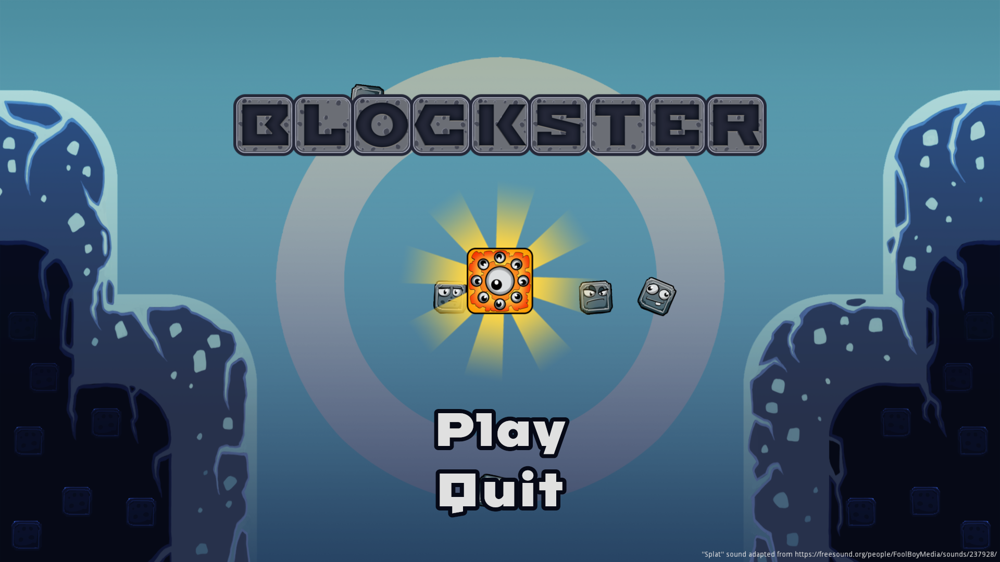

https://github.com/mbianchidev/blockster-2d/assets/37507190/92e1f3a1-e005-4cbe-8422-c56271accb9e

Neighbour's grass is always greener! Reach your annoying neighbour's house while preventing it to do the same! Throw blocks and die a lot in a frenetic pvp duel! 
Game is 1v1 in local coop. 2 joysticks are required.

# For devs

Opening the project requires [Godot Engine](https://godotengine.org/) 3.1+

The tested builds are for Linux 64 bit and Windows 64 bit.
It's probably possible to export for Mac and HTML5 as well.

# Copyright

Copyright (c) 2019 - Honourable Death Bunnies
Link to the GGJ website: https://globalgamejam.org/2019/games/blockster
